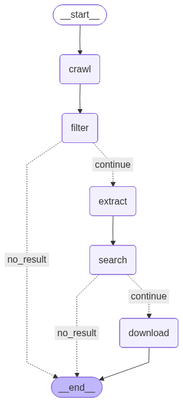

# Noise Barrier Intel

这是一个垂直领域情报挖掘 Agent 系统，目标是自动从新闻公告中发现与高速公路声屏障相关的项目，并进一步检索对应的环评报告，实现从网页抓取、相关性过滤、结构化信息抽取到 PDF 下载解析的端到端自动化流程。 这个项目的关键不在于单点爬虫，而在于多阶段 Agent Workflow 的设计，以及在异构网页和非结构化文本场景下，如何利用 LLM 做动态决策和信息补全。

## 核心工作流 (Agent Workflow)

系统的工作流由 LangGraph 驱动，通过大模型进行多步决策与执行，具体流程如下：



1. **crawl**: 爬取新闻/公告详情页的具体 HTML 内容。
2. **filter**: 使用 LLM (MiniMax) 判断新闻内容是否与我们的目标（如：高速公路声屏障、环评等）相关，过滤无关数据。
3. **extract**: 利用搜索 Agent 提取项目详情（项目名称、投资总额、声屏障工程量、建设单位等），并智能生成下一步搜索所需的 Prompt。
4. **search**: 调用 MCP Tool (如阿里云 DashScope 搜索) 进行全网或指定网站检索，寻找项目对应的“环境影响评价报告”。
5. **download**: 找到目标环评链接后，自动下载 PDF 文件到本地 `downloads/` 目录，并解析其中的详细信息。

---

## 目录结构

```text
noise-barrier-intel/
├── backend/                    # 共享层：数据库配置 + ORM 模型 (SQLAlchemy)
├── crawl_service/              # 爬虫微服务：负责定时抓取新闻列表页 URL
├── agent_service/              # Agent 分析微服务：基于 LangGraph 的核心业务流
├── downloads/                  # PDF 环评文件存储目录
├── pyproject.toml              # 统一依赖与包管理 (支持 pip install -e .)
├── docker-compose.yml          # Docker 部署配置
└── .env                        # 环境变量配置 (API Keys, Database URL 等)
```

---

## 快速开始

### 1. 环境准备与依赖安装

由于本项目采用了标准的 Python Package 结构，推荐使用可编辑模式安装当前包（这样在任何目录下运行都不会有导包错误）。如果你使用 `uv` 管理虚拟环境：

```bash
uv pip install -e .
```

或者使用标准的 `pip`：

```bash
pip install -e .
```

### 2. 配置环境变量

请确保在项目根目录存在 `.env` 文件，并填入你自己的大模型 API Keys：

```env
MINIMAX_API_KEY=your_minimax_key_here
MINIMAX_BASE_URL=https://api.minimaxi.com/anthropic
DASHSCOPE_API_KEY=your_dashscope_key_here

# 数据库配置 (如果不填，系统会使用 config.py 中的默认本地 MySQL 配置)
# DB_USER=root
# DB_PASSWORD=your_password
# DB_HOST=localhost
# DB_PORT=3306
# DB_NAME=crawl_db
```

### 3. 运行服务

由于我们已经执行了 `pip install -e .`，所以你不再需要配置 `PYTHONPATH`，直接运行即可。

**运行爬虫服务 (抓取列表页并存入数据库):**
```bash
python crawl_service/main.py
```

**运行 Agent 分析服务 (执行 LangGraph 智能分析与下载流程):**
```bash
python agent_service/main.py
```

---

## Docker 部署 (可选)

本项目提供了 `docker-compose.yml`，支持一键启动数据库以及两个微服务：

```bash
docker-compose up --build -d
```